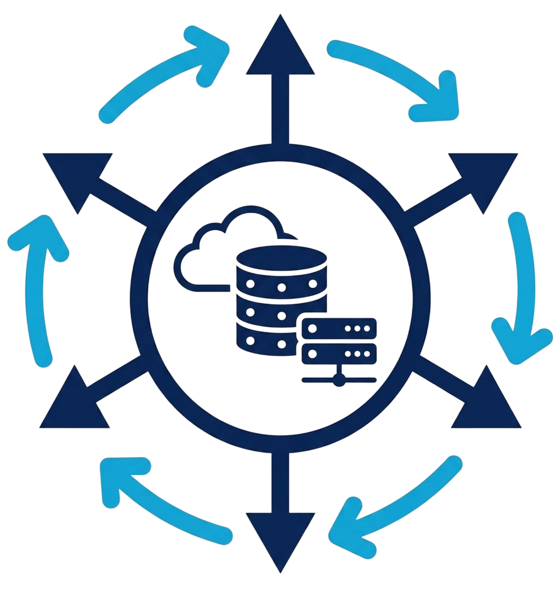

  

<h1 align="center">Cribrum Systems LLC</h1>

<em>Cribrum (Latin for <strong>sieve</strong>) - filtering the signal from the noise.</em>

---

We specialize in **secure backend architecture**, **container orchestration**, and the deployment of **applied ML models that perform in production**. We serve customers ranging from medical centers requiring strict HIPAA compliance to edge computing on factory floors.

Our stack is **open-architecture by design**: PyTorch/ONNX models, Kubernetes orchestration, and WireGuard-secured remote management. Production data never leaves your facilities unless you want it to.

We also provide **contract infrastructure engineering** and **technical consulting** for teams building backend systems, containerized deployments, and ML-integrated products.

---

## Stack

| Layer | Technology |
|---|---|
| ML | PyTorch · ONNX |
| Orchestration | Kubernetes · Docker |
| Networking | WireGuard · Cilium · Istio mTLS |
| Storage | SQLite · Postgres · self-hosted Gitea |
| Languages | Go · Rust · Python · Mojo · Node.js · SQL |

---

## Selected Projects

**[encrypted-k8-msgs](https://github.com/ION606/encrypted-k8-msgs)**
WireGuard (Cilium) + Istio mTLS layered across a Kubernetes cluster - demonstrates the kind of defense-in-depth network security we design for production environments with strict data residency requirements.
`Kubernetes` `Cilium/WireGuard` `Istio mTLS`

**[ollama-plus](https://git.ion606.com/ION606/ollama-plus)**
Self-hosted Open WebUI + Ollama stack with a RAG server, custom plugins, and a Docker-sandboxed code execution tool. A working example of ML infrastructure that stays entirely within your own facilities.
`Open WebUI` `RAG` `Sandboxed Exec` `Docker`

**[MailPocket](https://github.com/ION606/MailPocket)**
Lightweight Go server for form submission collection with CSV batching or SQLite persistence. Shows what we mean by backend systems that are simple to audit, deploy, and own.
`Go` `HTTP APIs` `SQLite`

---

> For private engagements, client work, and non-public repositories - [get in touch](https://cribrum.dev/contact).
